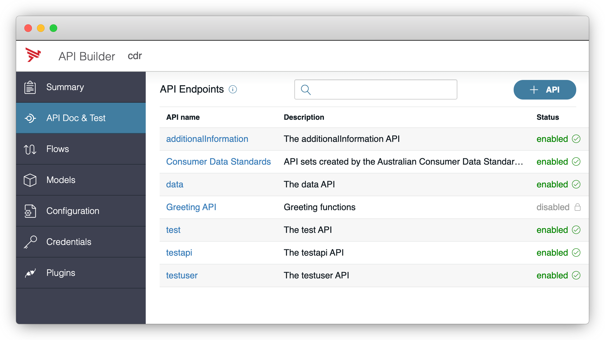
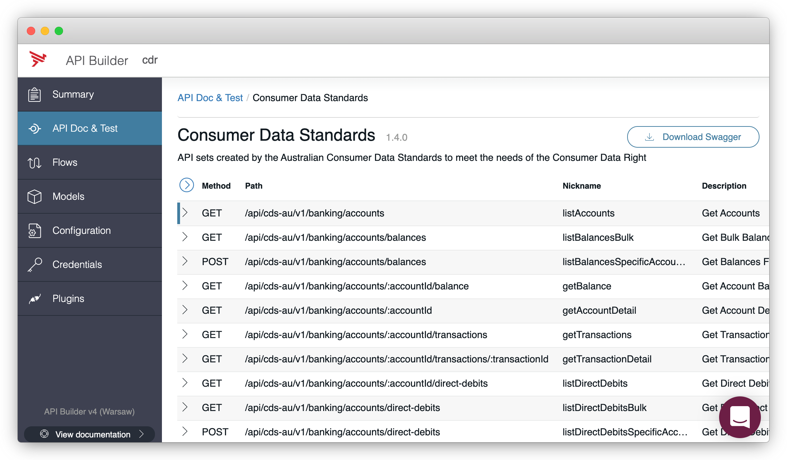

# CDR Implementation with API Builder

`npm install -g @axway/api-builder`

`git clone https://github.com/u1i/cdr-apibuilder`

`cd cdr-apibuilder`

`npm install`

`npm start`

--> http://localhost:8080/console

